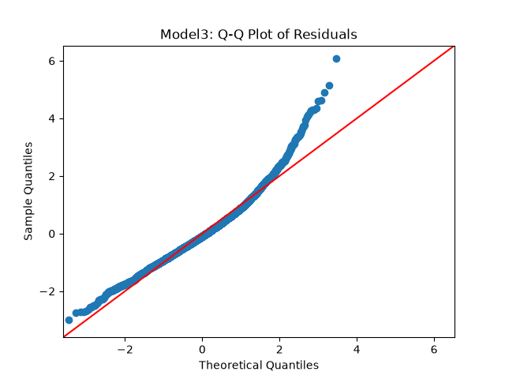
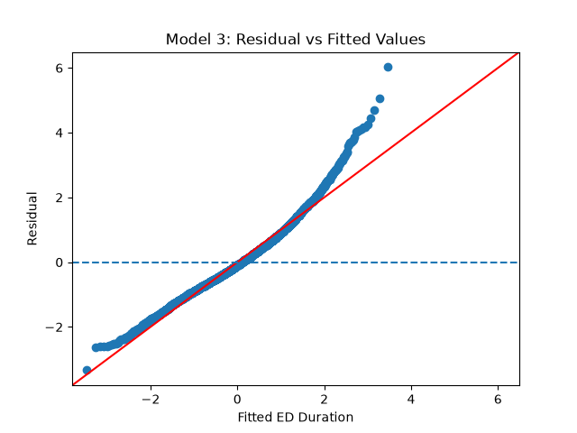

# Modeling-Emergency-Department-Congestion
Utilizing Linear Regression and Machine Learning Frameworks to Predict and Analyze Emergency Room Wait Times

Emergency department congestion remains a significant operational challenge in the U.S. healthcare system. The purpose of this project is to investigate hospital characteristics and operational metrics that can be used to model and predict emergency department performance.

The primary outcome analyzed in this project is the **OP_18a** quality measure, which reports the median time (in minutes) that patients spend in a hospital emergency department (ED) from arrival to departure.

This project investigates how emergency department volume and hospital characteristics—including hospital type, ownership, and geographic location—relate to variation in OP_18a. Statistical regression and machine learning models are then used to quantify these relationships and evaluate how accurately ED duration can be predicted from publicly available hospital data.

## Data Sources

The data used in this project were obtained from the Centers for Medicare & Medicaid Services (CMS) Provider Data Catalog.

The analysis uses:

- **Hospital General Information** — hospital-level characteristics including facility type, ownership, location, and emergency service availability.
- **Timely and Effective Care – Hospital** — hospital-level quality measures including emergency department performance measures.

The original datasets used for this analysis are stored in `data/raw/`, while datasets produced during preprocessing are stored in `data/processed/`.

CMS periodically updates these datasets, so results obtained from newer releases may differ from those reported in this repository.

## Data Preparation

The CMS dataset contains hospital information in long format. ED measures were isolated and then transformed into a hospital-level dataset using Facility ID as the primary identifier.

The following ED measures were considered:

| Measure | Description |
|---------|---:|
| OP_18a  | Median total ED visit duration |
| OP_18b  | Median ED duration excluding transfers and psychiatric patients |
| OP_18c  | Median ED duration for psychiatric/mental health patients |
| OP_18d  | Median ED duration before transfer |
| OP_22   | Percentage of patients who left before being seen |
| OP_23   | Head CT results measure |
| EDV     | Categorical ED volume |

## Exploratory Data Analysis

Exploration and processing of the data was conducted to understand structure, identify missing data values and outliers, examine the features, and investigate relationships/correlations among hospital characteristics and ED performance.

The final processed data set resulted in 4658 observations. Each observation includes with two identifiers (Facility ID, Facility Name), eight categorical/geographic features (City/Town, State, ZIP, County/Parish, ed_volume, Hospital Type, Hospital Ownership, and Emergency Services), and 6 numerical features (OP_18a, OP_18b, OP_18c, OP_18d, OP_22, OP_23).

### Missing Data

Missing data varied substantially across the ED measures. OP_18a and OP_18b had relatively high coverage, whilst measures such as OP_18c, OP_18d, and OP_23 were unavailable for a substantial proportion of hospitals.

Due to OP_18a being selected as the primary prediction target, observations without a reported OP_18a value or other required modeling features were excluded from the modeling sample. This resulted in the 3745 observations for the primary statistical and machine learning analysis.

## Feature Distributions and Relationships

A primary motivator to not including every available ED measure in the predictive models was the relationship between OP_18a and OP_18b.

The two measures evinced strong correlation with Corr(OP_18a, OP_18b) = 0.993.

Since both variables measure closely related definitions of ED visit duration, including OP_18b as a predictor of OP_18a would introduce redundant information and effectively provide the model with a close proxy for the prediction target.

Hence, OP_18a was isolated as the primary outcome, allowing the analysis to focus on whether broader hospital characteristics (i.e ed_volume, Hospital Type, Hospital Ownership) could explain the variation in ED duration.

An interesting result that arose was Corr(OP_18a, OP_22) = 0.524 and Corr(OP_18b, OP_22) = 0.522. The positive correlation, not necessarily causation, supports the idea that congestion and patient abandonment are related.

## Statistical Analysis of ED Congestion

### Baseline OLS Regression

In order to establish a statistical baseline, ordinary least squares (OLS) regression was used to examine how the observable hospital characteristics were associated with median ED duration.

The first model considered ED volume as the sole explanatory variable:

OP_18a ~ ED Volume

'low' ED volume was utilized as a reference category.

|ED Volume | Mean OP_18a |
| ---|---:|
|Low | 131.2 min|
|Medium | 175.5 min|
|High | 197.6 min|
|Very High | 202.5 min|

Relative to low volume hospitals, the baseline model estimated increases in median ED duration, approximately:
- **+44.3 minutes** for medium volume hospitals
- **+66.4 minutes** for high volume hospitals
- **+71.3 minutes** for very high volume hospitals

The baseline model also had an **R^2 of 0.358,** indicating that ED volume alone explained 35.8% of the observed cross-sectional variation in 'OP_18a'.

These results then established ED volume as an important predictor of ED duration, while the remaining unexplained variation indicates that the volume alone is insufficient to characterize hospital congestion.

### Expanded OLS Models

The baseline model was then expanded to determine whether other observable hospital characteristics could explain the added variation.

**Model 1: ED Volume**

The first model including only categorical ED volume achieved
- **R^2 = 0.358**

**Model 2: ED Volume + Hospital Type** or OP_18a ~ ED Volume + Hospital Type

Hospital Type was added to account for the differences between hospitals. The modeling sample contained primarily Acute Care Hospitals and Critical Access Hospitals.

After Controlling ED Volume, Critical Access Hospitals were associated with approximately **21.8 fewer minutes** of median ED duration relative to Acute Care Hospitals.

Explanatory power increased to:
- **R^2 = 0.377**

**Model 3: ED Volume + Hospital Type + Hospital Ownership** or OP_18a ~ ED Volume + Hospital Type + Hospital Ownership

The Final OLS model included Hospital Ownership, in order to investigate whether organizational structure was associated with ED performance.

The results of Model 3 included
- **R^2 = 0.400**
- **Adjusted R^2 = 0.398**

Across the three specifications, explanatory power increased as additional hospital characteristics were introduced:

| Model   | Features                                       |   R^2 |
|---------|------------------------------------------------|------:|
| Model 1 | ED Volume                                      | 0.358 |
| Model 2 | ED Volume + Hospital Type                      | 0.377 |
| Model 3 | ED Volume + Hospital Type + Hospital Ownership | 0.400 |

The addition of hospital characteristics alluded to an improvement beyond ED Volume, except 60% of the variation is left unexplained.

### Regression Diagnostics

Regression diagnostics were performed to evaluate the assumptions of the OLS inference and to investigate the structure of the remaining prediction errors.

#### Residual Distribution



For Model 3, the residual distribution indicated positive skewness and excess kurtosis:
- **Skewness = 0.782**
- **Kurtosis = 4.847**

The elevated kurtosis allude to heavier tails for extreme values than what is expected under the normal error distribution, suggesting a higher frequency of large prediction errors.

A Q-Q plot was created to visually assess residual normality. Observations along the center followed the approximate theoretical normal reference line, but the curving around the tails was consistent with the elevated kurtosis indicating more frequent errors than predicted using a normal distribution.

#### Heteroskedasticity



A residual vs fitted plot was created to examine if residual variance remained consistent across predicted levels of ED duration. The dispersion suggested non-constant variance.

A Breusch-Pagan test was then used to formally indicate whether the variance exhibited heteroskedasticity (non-constant residual variance).
The Lagrange Multiplier (LM) Statistic will measure how much the independent variables explain the variance.
The p-value assigned will determine whether the residuals display homoskedasticity or heteroskedasticity
- **LM Statistic = 197.70**
- **p < 0.001**

The null hypothesis of constant error variance was strongly rejected, providing evidence for heteroskedasticity in the OLS residuals.

Since heteroskedasticity can invalidate the conventional OLS standard errors, a coefficient inference was reported using **HC3 heteroskedasticity-robust standard errors**. The OLS coefficient estimates remain unchanged, while the covariance matrix is adjusted to provide more reliable standard errors, confidence intervals, and hypothesis tests under the non constant variance.

### Residual Analysis

Although the expanded OLS models improved the explanatory power, a substantial portion of variation remained unexplained. Residuals from Model 3 were therefore analyzed to identify hospitals whose observed ED duration differed substantially from their predicted ED volume, Hospital Type, and Hospital Ownership.

The residual for hospital \(i\) was defined by:

'Residual = Observed OP_18a - Predicted OP_18a'

A large positive residual identifies a hospital where patients spent substantially longer in the ED than predicted by the model, whilst a large negative residual identifies a hospital where patients spent a substantially shorter time in the ED than predicted by the model.

Several hospitals exhibited a deviation exceeding 100 minutes in both directions, with the most extreme positive residual exceeding 240 minutes.

Dispersion of residuals also differed across ED volume categories:

| ED Volume | Residual Std. Dev. |
|---|-------------------:|
| Low |           31.5 min |
| Medium |           37.0 min |
| High |           46.1 min |
| Very High |           51.9 min | 

The increasing residual dispersion among higher volume hospitals suggests that hospitals facing similar levels of ED demand can nevertheless experience substantially different operational outcomes.

## Machine Learning Analysis

The OLS analysis demonstrated that ED volume and hospital characteristics explained a good portion of the variation in 'OP_18a,' but substantial hospital level residual variation remained.

Machine learning models were thus evaluated to determine whether nonlinear relationships among the available characteristics could improve upon OLS.

The prediction target remained 'OP_18a'. The predictive features were:
- ED Volume
- Hospital Type
- Hospital Ownership
- State

Categorical variables were transformed using OneHotEncoding, and the data was split into training and test sets. Hyperparameter tuning was performed using a 5-fold cross validation on the training data.

Model performance was evaluated using the following:
- **Mean Absolute Error (MAE)**
- **Root Mean Squared Error (RMSE)**
- **R^2** proportion of the variation in `OP_18a` explained by the model

A Dummy Regression was used as a **naive** benchmark before evaluating Ridge Regression, Random Forests, and Gradient Boosted Trees.

### Dummy Baseline

A dummy regressor was used to establish the naive prediction benchmark. This model does not attempt to learn relationships between hospital characteristics and ED duration. It provides a reference which will later be used to evaluate the predictive value of subsequent models.

The dummy model produced:

| Metric | Test Performance |
|---|-----------------:|
| MAE |       38.984 min |
| RMSE |       49.798 min |
| R^2 | -0.001 | 

The R^2 value of -0.001 indicates the baseline provides essentially no explanatory power for differences in ED duration.

### Ridge Regression

Ridge Regression, from sklearn, was used as the first predictive model. Thus, providing a regularized linear benchmark before introducing nonlinear tree-based methods.

The regularization parameter 'alpha' was selected using the 5-fold cross validation. The best performing value was:

'alpha = 2.0'

Cross validation performance was:
- **CV MAE = 28.116 minutes**

- The tuned model was subsequently evaluated on the test set:

| Metric | Test Performance |
|---|---:|
| MAE | 27.604 min |
| RMSE | 36.040 min |
| R^2 | 0.476 |

Hence, Ridge Regression substantially outperformed the dummy baseline, indicating that the available hospital characteristics contain meaningful predictive information.

### Random Forest

A Random Forest Regressor, using sklearn, was introduced to determine whether nonlinear relationships and interactions among the characteristics could explain additional variation.

Hyperparameters were selected using the 5-fold cross validation over tree depth, feature sampling, and minimum leaf size. The selected parameters were:
- 'max_depth = 20'
- 'max_features = sqrt'
- 'min_sample_leaf = 2'

The tuned Random Forest Achieved:
- **CV MAE = 27.965 minutes**

The performance test for Random Forest yielded:

| Metric | Test Performance |
|---|-----------------:|
| MAE |       27.088 min |
| RMSE |       35.505 min |
| R^2 |            0.491 |

Random Forest improved upon Ridge Regression, though improvements were small.

### Gradient Boosted Trees

Gradient Boosted Trees were evaluated as a second nonlinear approach. Gradient Boosted Trees was picked to sequentially construct trees to reduce errors from previous learners.
The initial Gradient Boosted Trees model achieved a strong training performance:
- **Training MAE = 24.348 minutes**
- **Training R^2 = 0.607**

However, the 5-fold cross validation produced:
- **CV MAE = 28.839 minutes**
- **CV R^2 = 0.446**

The difference between the two results suggest overfitting of the data.

The model was regularized through cross validated hyperparameter selection with values:
- 'learning rate = 0.1'
- 'max_leaf_nodes = 5'
- 'min_samples_leaf = 20'
- 'l2_regularization = 1.0'

After tuning, cross validation MAE improved to **27.851 minutes**.
The final test results was:

| Metric | Test Performance |
|---|-----------------:|
| MAE |       27.126 min |
| RMSE |       35.960 min |
| R^2 |            0.478 |


### Model Comparison

| Model | CV MAE | Test MAE | Test RMSE | Test R² |
|---|---:|---:|---:|---:|
| Dummy Baseline | — | 38.984 | 49.798 | -0.001 |
| Ridge Regression | 28.116 | 27.604 | 36.040 | 0.476 |
| Random Forest | 27.965 | **27.088** | **35.505** | **0.491** |
| Gradient Boosted Trees | **27.851** | 27.126 | 35.960 | 0.478 |

### Interpretation

All three predictive models substantially outperformed the dummy baseline. However, increasing the nonlinear capabilities of subsequent models produced only a small improvement to the Ridge Regression.

The best performing model, which was Random Forest, reduced test MAE from 38.984 minutes (dummy baseline) to 27.088 minutes.

However, Random Forest improved MAE by only 0.516 minutes relative to the Ridge Regression. Gradient Boosted Trees produced similar small improvements despite the greater nonlinear modeling capabilities.

This convergence then suggests that model complexity is no longer the primary limitation on predictive performance. However, the remaining unexplained variation could likely be from information not represented in the feature set.

## Conclusion

This project investigated whether publicly available hospital characteristics can explain and predict variation in ED visit duration.

ED volume emerged as an important predictor of `OP_18a`, while Hospital Type and Hospital Ownership provided additional explanatory information. Machine learning models substantially outperformed the baseline, with Random Forest achieving the strongest test performance with an MAE of **27.088 minutes**, RMSE of **35.505 minutes**, and R^2 of **0.491**.

However, Ridge Regression, Random Forest, and Gradient Boosted Trees all produced similar performances. The limited improvements despite subsequent model complexity capabilities suggest that the primary constraint may be the information available rather than model capabilities.

The substantial residual variation between hospitals thus motivates further investigation into operational characteristics that are not represented in the current CMS data.

## Limitations and Future Work

The primary limitation of the current analysis is that the available features provide only an uneven representation of the operational mechanisms that cause ED congestion.

ED volume provides information about relative demand, but congestion itself is determined by the relation of demand and the hospital's ability to work through that demand. Important operational variables such as available treatment capacity, bed availability, patient health, arrival patterns and so on are not directly represented in the current data set.

Future work could include these other important operational variables, and the models presented in this project can serve as a benchmark for future work.

## Repository Structure

```text
Modeling-Emergency-Department-Congestion/
│
├── data/
│   ├── raw/
│   │   ├── Hospital_General_Information.csv
│   │   └── Timely_and_Effective_Care-Hospital.csv
│   └── processed/
│       ├── ed_hospital_measures.csv
│       └── ed_hospital_modeling.csv
│
├── notebooks/
│
├── results/
│   └── figures/
│       ├── qq_plot.png
│       └── residual_vs_fitted.png
│
├── src/
│   ├── data_processing.py
│   ├── queue_analysis.py
│   └── ml_model.py
│
├── .gitignore
├── LICENSE
├── README.md
└── requirements.txt
```

The analysis is divided into three primary scripts:

- `data_processing.py` cleans and reshapes the CMS data and constructs the hospital level modeling dataset that is ultimately used.
- `queue_analysis.py` performs the statistical analysis, OLS modeling, regression diagnostics, and residual analysis.
- `ml_model.py` implements the machine learning pipelines, cross validation, hyperparameter tuning, and final model evaluation.

## Reproducing the Analysis

### 1. Clone the repository

```bash
git clone https://github.com/adrielruston-maker/Modeling-Emergency-Department-Congestion.git
cd Modeling-Emergency-Department-Congestion
```

### 2. Create and activate a virtual environment

```bash
python -m venv .venv
source .venv/bin/activate
```

### 3. Install dependencies

```bash
pip install -r requirements.txt
```

### 4. Run the analysis

The scripts should be executed in the following order:

```bash
python src/data_processing.py
python src/queue_analysis.py
python src/ml_model.py
```

`data_processing.py` generates the processed datasets required by the statistical and machine learning analyses.

## License

This project is licensed under the terms specified in the [`LICENSE`](LICENSE) file.

The underlying hospital data are publicly provided by the Centers for Medicare & Medicaid Services (CMS).
